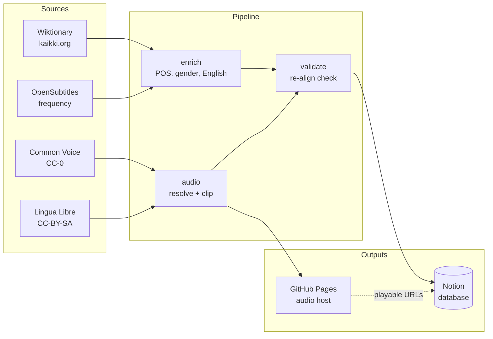

# Macedonian Vocabulary Pipeline

> Build a rich, audio-enabled Macedonian vocabulary database in Notion — enriched from open dictionaries and voiced by real human speakers.

[](https://github.com/viktor1223/Macedonian-Notion-Updates/actions/workflows/ci.yml)
[](https://www.python.org/downloads/)
[](LICENSE)
[](docs/data-sources.md)

A production pipeline that turns a plain word list into a fully enriched language-learning database: part of speech, gender, English gloss, Latin transliteration, CEFR level, frequency band, and — most importantly — **real human pronunciation audio** extracted from open speech corpora.

Every word links to a playable audio clip. No text-to-speech, no synthetic voices — just native Macedonian speakers.

## Why this exists

Learning a lower-resource language like Macedonian is hard because the tooling barely exists. Commercial apps skip it, and the open data that does exist (Wiktionary, Common Voice, Lingua Libre) is scattered across incompatible formats. This project stitches those sources into a single, coherent, audio-rich vocabulary system you can actually study from — in Notion today, and Anki flashcards next.

## What it does

- **Enriches vocabulary** from a 66K-entry Wiktionary dictionary — no LLM required for core fields
- **Extracts word-level audio** from full-sentence recordings using Meta's MMS forced-alignment model
- **Hosts audio publicly** via GitHub Pages so it plays directly in Notion
- **Syncs to Notion** — updates existing pages and creates new ones from frequency lists
- **Validates audio** by re-aligning clips against their expected word (catches misaligned extractions)

## Pipeline at a glance



## Quickstart

```bash
# 1. Clone and install
git clone https://github.com/viktor1223/Macedonian-Notion-Updates.git
cd Macedonian-Notion-Updates
pip install -e ".[audio,dev]"

# 2. Configure your Notion token
cp .env.example .env
# edit .env and add your NOTION_TOKEN

# 3. Run the pipeline
python cli.py fetch      # pull vocabulary from Notion
python cli.py enrich     # add POS, gender, English (dictionary-only, no AI)
python cli.py push       # write enrichment back to Notion
```

See [docs/setup.md](docs/setup.md) for full setup and [docs/usage.md](docs/usage.md) for every command.

## Commands

| Command | What it does |
| --- | --- |
| `fetch` | Pull the vocabulary database from Notion into a CSV |
| `enrich` | Add POS, gender, English, Latin from the dictionary (`--ai` for LLM fallback) |
| `audio` | Resolve pronunciation audio from Lingua Libre, Common Voice, FLEURS |
| `clip-all` | Extract every word from Common Voice sentences via forced alignment |
| `push` | Write enrichment updates back to existing Notion pages |
| `create` | Create new Notion pages from a frequency-list import |
| `build-dict` | Build the local dictionary from a kaikki.org download |
| `build-freq` | Compute frequency bands from corpora |
| `download` | Download Macedonian corpora (Wikipedia, Wiktionary) |
| `full` | Run fetch to enrich to push in sequence |

## Project structure

```text
cli.py                  Single entry point for every command
src/
  core/                 Shared utilities (romanize, audio I/O, Notion client, file discovery)
  pipeline/             Data processing (enrich, clip extraction, audio resolution, validation)
  builders/             One-time builds (dictionary, frequency bands, corpora download)
  notion/               Notion integration (fetch, push, create, schema)
tests/                  Unit tests (romanization, audio I/O, dictionary lookup)
sources/                Checked-in reference data (dictionaries, frequency lists)
docs/                   Documentation
```

See [docs/architecture.md](docs/architecture.md) for the design rationale.

## Documentation

- [Setup guide](docs/setup.md) — prerequisites, install, Notion token, environment
- [Usage guide](docs/usage.md) — every command with real examples
- [Pipeline overview](docs/pipeline.md) — how data flows end to end
- [Architecture](docs/architecture.md) — why the code is organized this way
- [Data sources and attribution](docs/data-sources.md) — licenses and credits
- [Contributing](CONTRIBUTING.md) — how to add features and run tests

## Audio hosting

Extracted clips are hosted at [viktor1223.github.io/macedonian-audio](https://viktor1223.github.io/macedonian-audio/) so Notion can play them directly. Each clip resolves to a stable URL like:

```text
https://viktor1223.github.io/macedonian-audio/clips/<word>.wav
```

## License and attribution

Code is licensed under the [MIT License](LICENSE). The linguistic and audio data retain their original licenses — Common Voice (CC-0), Lingua Libre (CC-BY-SA 4.0), and Wiktionary/kaikki.org (CC-BY-SA). Full credits are in [docs/data-sources.md](docs/data-sources.md).

Audio is sourced from real Macedonian speakers via [Mozilla Common Voice](https://commonvoice.mozilla.org/) and [Lingua Libre](https://lingualibre.org/). This project would not be possible without the volunteers who contributed their voices.
