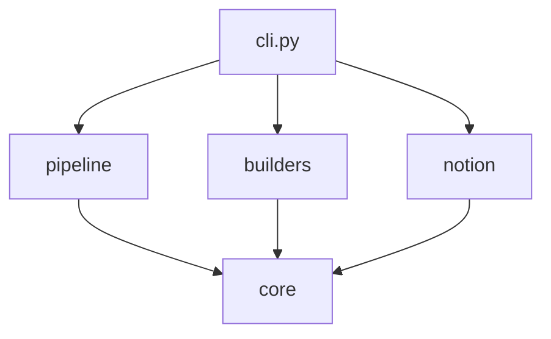

# Architecture

This document explains how the codebase is organized and why.

## Design goals

- **One entry point.** Everything runs through `cli.py`. No hunting for the right script.
- **Layered packages.** Shared primitives at the bottom, domain logic in the middle, integrations at the edge.
- **No hidden state.** Every processing step reads and writes explicit, timestamped files in `output/`.
- **Optional heavy dependencies.** Audio (torch) and AI (openai) are opt-in so the core install stays light.

## Package layout

```text
cli.py              Argument parsing and command dispatch
src/
  core/             Foundation: no dependencies on other src packages
    romanize.py       Cyrillic to Latin transliteration
    audio_io.py       Load, save, resample, measure audio
    notion_client.py  Notion REST wrapper + property builders + DATABASE_ID
    files.py          Discover latest output files; PROJECT_ROOT, OUTPUT_DIR, AUDIO_DIR
  pipeline/         Data processing: depends on core
    enrich.py         Dictionary + LLM enrichment
    clip_extract.py   MMS forced alignment and word extraction
    audio_resolve.py  Multi-source audio fetch
    validate.py       Re-alignment quality check
    verify.py         Cross-source MFCC verification
    deduplicate.py    Duplicate detection
  builders/         One-time data builds: depends on core
    dictionary.py     Build the kaikki dictionary
    frequency.py      Build frequency bands
    corpora.py        Download Wikipedia / Wiktionary
    assign_bands.py   Assign words to bands
    apply_bands.py    Apply bands to an export
  notion/           Notion integration: depends on core
    fetch.py          Read the database
    push.py           Update existing pages
    create.py         Create new pages
    schema.py         Manage database schema
```

## Dependency direction



`core` never imports from `pipeline`, `builders`, or `notion`. This keeps the foundation reusable and testable in isolation. The three middle packages depend only on `core`, and `cli.py` wires them together.

## Path resolution

Modules inside `src/` resolve the project root with:

```python
Path(__file__).parent.parent.parent
```

Shared anchors (`PROJECT_ROOT`, `OUTPUT_DIR`, `AUDIO_DIR`) live in `src/core/files.py` so paths are defined in exactly one place.

## File discovery convention

Pipeline commands avoid manual file juggling by auto-selecting the most recent relevant artifact. `src/core/files.py` provides `latest_file()`, `latest_export()`, and `latest_enriched()`. Because every run writes a timestamped file, this is deterministic and non-destructive — no run overwrites another.

## Notion integration

`src/core/notion_client.py` centralizes the Notion REST surface: token loading, `query_database()`, `update_page()`, `create_page()`, and typed property builders (`multi_select`, `select`, `rich_text`, `title`). The database ID and API version (`2022-06-28`) are constants here. The `notion/` package composes these primitives into full workflows.

## Testing strategy

Tests target the pure, dependency-free parts of `core` and `pipeline`:

- `tests/test_romanize.py` — transliteration correctness, including the Macedonian-specific letters `ѓ ќ ѕ џ љ њ ј`
- `tests/test_audio_io.py` — save/load round-trips (correlation-based, tolerant of float precision) and duration
- `tests/test_dictionary.py` — exact match, inflection stripping, and phrase head-word extraction

These run without network access, a Notion token, or the audio/AI dependency groups, so they are fast and CI-friendly.

## Extending the system

- **New audio source:** add an entry to `audio_sources.yaml` and a resolver branch in `src/pipeline/audio_resolve.py`.
- **New Notion property:** add a builder in `src/core/notion_client.py` and reference it from `src/notion/push.py`.
- **New enrichment field:** extend the dictionary schema in `src/pipeline/enrich.py` and the push payload.

See [CONTRIBUTING.md](../CONTRIBUTING.md) for the development workflow.
