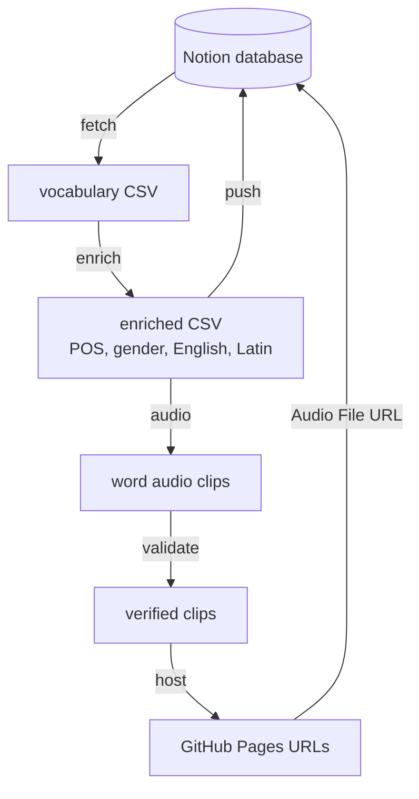

# Pipeline overview

This document explains how a Macedonian word travels from a raw source to a fully enriched, audio-enabled Notion page.

## End-to-end flow

## Stage 1 — Enrichment

**Input:** a word list (from Notion or a frequency import)
**Output:** POS, gender, English gloss, Latin transliteration, and optionally Category and Level

The enricher (`src/pipeline/enrich.py`) resolves each word against a local dictionary built from the [kaikki.org](https://kaikki.org/dictionary/Macedonian/) Macedonian Wiktionary extract.

1. **Exact match** — look the word up directly.
2. **De-inflection** — if no match, strip common Macedonian suffixes (definite articles `ата`, `ото`, `ите`; verb endings `ам`, `аш`, `а`) and retry.
3. **Phrase lookup** — for multi-word entries, strip particles and prepositions, then look up the head word.
4. **LLM fallback (optional)** — with `--ai`, words still unresolved go to `gpt-4o-mini`, which returns Category and CEFR Level as JSON.

The dictionary provides POS, gender, English gloss(es), romanization, inflected forms, and verb aspect (perfective/imperfective).

### How it is performed

- **Command:** `python cli.py enrich [FILE]` (add `--ai` for the LLM fallback)
- **Entry point:** `src/pipeline/enrich.py` — `dict_lookup()`, `phrase_lookup()`, `load_dictionary()`
- **Dictionary file:** `sources/dictionaries/mk_kaikki_dictionary.json` (built by `python cli.py build-dict`)
- **De-inflection:** suffix stripping is applied longest-match-first so `водата` resolves to `вода` before shorter suffixes are tried
- **LLM call:** `gpt-4o-mini` via GitHub Models by default, or Azure OpenAI when `AZURE_OPENAI_ACCOUNT_NAME` and `AZURE_OPENAI_RESOURCE_GROUP` are set. The Azure key is fetched at runtime through the `az` CLI and never written to disk. The model returns strict JSON (`position`, `category`, `level`, `english`, `latin`)
- **Cost control:** without `--ai` the stage makes zero network calls; the LLM path is capped by the provider quota (GitHub Models: 450 calls/day)

## Stage 2 — Audio resolution

**Input:** enriched words
**Output:** a pronunciation clip per word

Sources are checked in the priority order defined in [audio_sources.yaml](../audio_sources.yaml):

| Priority | Source | Method | License |
| --- | --- | --- | --- |
| 1 | Lingua Libre | Direct API lookup (word-level recordings) | CC-BY-SA 4.0 |
| 2 | Common Voice | Forced alignment from sentences | CC-0 |
| 3 | FLEURS | Forced alignment from sentences | CC-BY 4.0 |
| 4 | VoxPopuli | Forced alignment (disabled by default) | CC-0 |

Lingua Libre is preferred because its recordings are already isolated single words. The other sources are full sentences, so the pipeline must extract the target word.

### Forced alignment

For sentence-based sources, the pipeline uses **Meta MMS** (Massively Multilingual Speech) via `torchaudio.pipelines.MMS_FA`:

1. Romanize the Cyrillic sentence transcript (CTC tokenizer works on Latin).
2. Run CTC forced alignment to get a start and end time for each word.
3. Extract the target word's slice with a small padding margin (default ±40 ms).
4. Record a confidence score; clips below the `min_confidence` threshold (default 0.4) are rejected.

### How it is performed

- **Commands:** `python cli.py audio [FILE]` (multi-source resolve) and `python cli.py clip-all` (bulk Common Voice extraction)
- **Entry points:** `src/pipeline/audio_resolve.py` — `run_batch()`; `src/pipeline/clip_extract.py` — `Aligner` class
- **Model load:** `torchaudio.pipelines.MMS_FA` provides the acoustic model, tokenizer, and CTC aligner; audio is resampled to 16 kHz before alignment
- **Word indexes:** each sentence source has a prebuilt index (`audio/common_voice_word_index.csv`, `audio/fleurs_mk_word_index.csv`, `audio/lingua_libre_mk_index.csv`) mapping a target word to the sentence that contains it
- **Rate limiting:** Lingua Libre requests wait 1.5 s between lookups and 0.5 s between downloads to respect the Wikimedia API
- **Output:** clips are written to `audio/words/` (Lingua Libre) or `audio/clips/` (extracted), with metadata and confidence in timestamped `audio/clip_*.csv` files

## Stage 3 — Validation

**Input:** extracted clips
**Output:** clips confirmed to contain the right word

Because forced alignment can drift, extracted clips are re-checked. When a word has audio from two or more sources, the pipeline runs an MFCC cross-source comparison to confirm the clips are consistent. This catches misaligned extractions before they reach Notion.

### How it is performed

- **Entry points:** `src/pipeline/validate.py` — `AudioValidator` (re-aligns a clip against its expected word and grades pass/warn/fail); `src/pipeline/verify.py` (cross-source MFCC comparison)
- **Re-alignment check:** the validator runs the same MMS aligner on the isolated clip and confirms the expected word scores above a pass threshold (default 0.5, warn at 0.3)
- **Cross-source check:** when two sources exist for a word, MFCC feature vectors are compared; large divergence flags a likely mis-extraction
- **Output:** verification results are written to `output/audio_verification_*.csv` for review

## Stage 4 — Hosting and sync

**Input:** verified clips + enriched data
**Output:** playable Notion pages

Notion cannot play audio from local file paths, so clips are hosted on GitHub Pages at [viktor1223.github.io/macedonian-audio](https://viktor1223.github.io/macedonian-audio/). Each clip becomes a stable public URL that the `push` step writes into the page's **Audio File** property, making it playable inline.

The `push` step updates existing pages; `create` makes new ones from a frequency import.

### How it is performed

- **Commands:** `python cli.py push [FILE]` (update existing pages) and `python cli.py create [FILE]` (create new pages)
- **Entry points:** `src/notion/push.py` — `build_page_payload()`, `update_page()`; `src/notion/create.py`
- **Hosting:** verified WAV clips are pushed to the separate `macedonian-audio` repository and served via GitHub Pages; the public URL is `https://viktor1223.github.io/macedonian-audio/clips/<url-encoded-word>.wav`
- **Notion write:** the URL goes into the page's `Audio File` property as an external file object, which Notion renders as an inline audio player; attribution goes into the `Audio Source` property
- **Auth:** the Notion integration token is read from the `NOTION_TOKEN` environment variable at runtime; it is never logged or committed
- **Idempotency:** rows carrying an existing Notion page `id` are updated in place; rows without an `id` become new pages, so re-running is safe

## Why this order

Enrichment comes first because audio resolution and validation both benefit from knowing the word's romanization and lemma. Hosting is last because only verified clips should be published. Each stage writes a timestamped artifact to `output/`, so any stage can be re-run independently without repeating earlier work.
